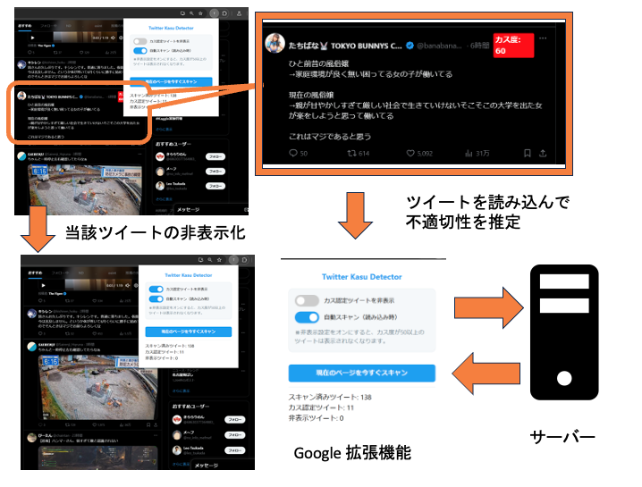
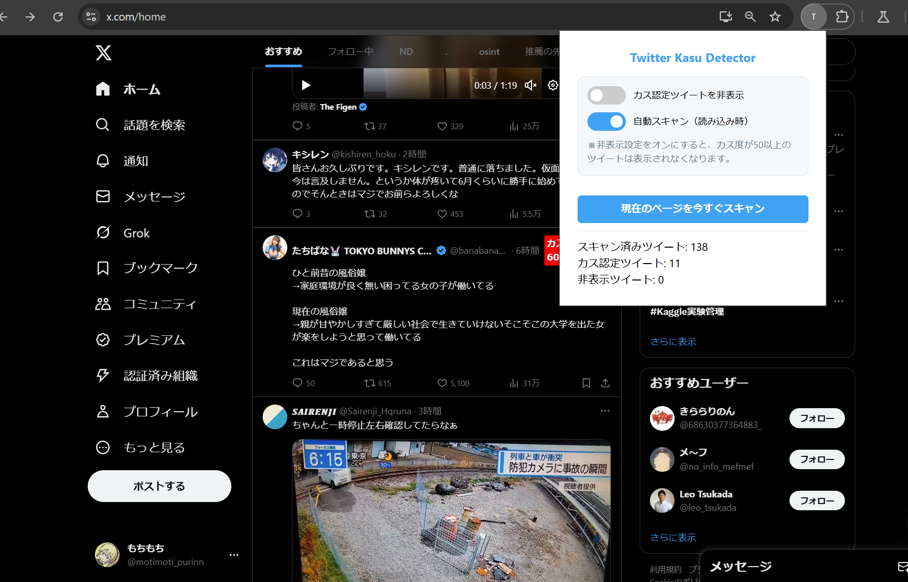

# GuardScope

## openAI API keyを自身で設定してください

## 不適切度の推定の精度の上昇が本プロジェクトの本質でもあるので、現状不十分であることはご了承ください
```
python3 server.py
```
でFlaskが立ちます。
Chrome devをinstallして、拡張機能->パッケージ化されていない拡張機能の読み込み->chrome_extentionのディレクトリを選択->https://x.com/home を見に行って、Dev toolsを見るとちゃんと予測が走っていることが確認できる。あからさまにダメなやつが流れてきたら赤色のラベルがちゃんとつく。





